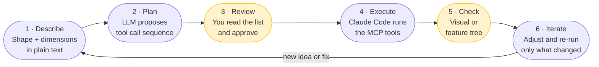

# AI-Assisted Design: Build Faster in SolidWorks

You know SolidWorks. You know the click path for a boss extrude, you know what a fully-defined sketch looks like, and you have a feel for which features will cause a rebuild error before you even run it.

This workflow keeps all of that knowledge and removes the slow parts — navigating menus, re-entering dimensions, rebuilding after a typo. Instead you **describe** what you're building in plain language, the LLM proposes the exact tool call sequence, you review it in ten seconds, and SolidWorks builds it.

The goal is faster iteration on *your* designs — not just recreating sample parts. The sample parts (`Paper Airplane.SLDPRT`, `Baseball Bat.SLDPRT`, the U-Joint) appear throughout because they're excellent practice targets: the finished `.SLDPRT` file exists, so you can open the original, read its feature tree, and check whether your AI-assisted build produced the same result. Once you're comfortable with the loop, apply it to your own work.

---

## What You Need

| Requirement | How to get it |
|---|---|
| SolidWorks installed and open | — |
| MCP server running | `.\dev-commands.ps1 dev-run` |
| Claude Code or VS Code Copilot Chat | [Claude Code setup](../getting-started/claude-code-setup.md) · [VS Code setup](../getting-started/vscode-mcp-setup.md) |
| Python virtualenv activated | `.\dev-commands.ps1 dev-install` once, then auto |

Quick server check — if the MCP server is running, this returns immediately:

```powershell
.\.venv\Scripts\python.exe -c "from solidworks_mcp.server import create_server; print('OK')"
```

---

## The Design Loop



**Steps 3 and 5 are yours.** Everything else the LLM handles. Never skip the review step — a 10-second read of a numbered plan saves you from a 5-minute undo.

---

## Step 1 — Describe What You're Building

The quality of the plan depends almost entirely on the quality of the description. Vague descriptions produce wrong dimensions. Precise descriptions produce working parts.

### What to include

1. **Shape** — what does it look like? What's the primary feature type (extrude, revolve, sweep, loft)?
2. **Sketch plane** — `"Front"`, `"Top"`, or `"Right"` (case-sensitive, no extra words)
3. **Key geometry** — the 2D profile with explicit coordinates or dimensions
4. **Feature dimensions** — depth, angle, thickness in millimetres
5. **Part name** — what to call the file

### Template

```text
I want to build a [part description].

Shape: [describe geometry type and profile]
Sketch plane: [Front / Top / Right]
Key dimensions:
  - [dimension 1]
  - [dimension 2]
  - ...
Part name: "[name]"

Write the MCP tool call sequence to build this from scratch.
Do not execute anything yet.
```

### Good vs. bad

=== "Good"

    ```text
    I want to build a mounting bracket.

    Shape: an L-shaped plate
    Sketch plane: Front
    Key dimensions:
      - Horizontal flange: 80 mm wide, 8 mm thick
      - Vertical flange: 60 mm tall, 8 mm thick
      - Outer corner is square, inner corner has a 5 mm fillet
    Holes:
      - Two 6 mm diameter holes on the horizontal flange, 15 mm from each end, centred through-thickness
    Part name: "Mounting Bracket"

    Write the MCP tool call sequence. Do not execute yet.
    ```

=== "Bad"

    ```text
    make an L-shaped bracket with some holes
    ```

    No dimensions. No plane. No hole sizes. The LLM will guess, and the guess will be wrong.

---

## Step 2 — Get the Plan

After your description, the LLM returns a numbered list of MCP tool calls. For a simple bracket it looks like this:

```
1.  create_part(name="Mounting Bracket")
2.  create_sketch(plane="Front")
3.  add_rectangle(x1=0, y1=0, x2=80, y2=-8)         # horizontal flange
4.  add_rectangle(x1=0, y1=-8, x2=8, y2=-68)        # vertical flange
5.  exit_sketch()
6.  create_extrusion(sketch_name="Sketch1", depth=30)
7.  create_sketch(plane="Front")
8.  add_circle(center_x=15, center_y=-4, radius=3)   # hole 1
9.  add_circle(center_x=65, center_y=-4, radius=3)   # hole 2
10. exit_sketch()
11. create_extrusion(sketch_name="Sketch2", depth=30, reverse_direction=True)
```

Read it like you would read a feature tree. Ask yourself:

- Are the dimensions what you intended?
- Is the order correct? (`exit_sketch` always before a feature)
- Does the sketch close? (open profiles fail)
- Is the part name right?

If anything looks off, say so before running. Fixing a text plan is instant. Fixing a failed extrude takes longer.

---

## Step 3 — Execute

Once the plan looks right:

```text
That looks correct. Execute each step using the SolidWorks MCP server.
Confirm each step succeeds before continuing.
If any step fails, stop and show me the error — do not skip and continue.
```

Claude Code calls each tool in sequence. SolidWorks builds the part live on your screen.

!!! tip "Watch SolidWorks while it runs"
    The geometry appears in real time. You'll see the sketch appear, then the extrusion, then each subsequent feature. If something looks obviously wrong early, you can say "stop" before it gets worse.

---

## Step 4 — Check the Result

### Quick visual

```text
Export an isometric view and show me the image:
export_image(file_path="C:/Temp/bracket_check.jpg", format_type="jpg")
```

Drag the image into the chat or open it in Photos. Does the shape match what you described?

### Feature tree check

For any part you've built:

```text
list_features()
```

This returns every feature in the tree by name and type. Check that the feature types and count match what you intended.

For the sample parts, you can go further — open the original and compare directly:

```text
open_model(file_path=r"C:\Users\Public\Documents\SOLIDWORKS\SOLIDWORKS 2026\samples\learn\Baseball Bat.SLDPRT")
list_features()
close_model(save=False)
```

If your reconstruction and the original both show `Boss-Revolve1` as the first feature on the `Right` plane, you're on track.

### Mass properties check

```text
get_mass_properties()
```

Returns volume, mass, and centre of mass. Useful for confirming wall thickness and material distribution.

---

## Step 5 — Iterate

This is where AI-assisted design is fastest. Every change is a one-line description, not a click-through menu path.

### Change a dimension

```text
The horizontal flange is 80 mm but I need 100 mm.
Update D1@Sketch1 and rebuild.
```

### Add a feature

```text
Add a 3 mm fillet to the inner corner of the L-shape.
Keep everything else.
```

### Fix a failed step

Paste the error message directly:

```text
Error: "Sketch is not closed - cannot create extrusion"
Show me the current sketch geometry and identify the gap.
```

### Start a sketch over

```text
Sketch2 is wrong. Delete it and replace it with:
- One circle at (15, -4), radius 3
- One circle at (65, -4), radius 3
Both on the Front plane.
```

---

## When to Use VBA

Some SolidWorks features are not yet exposed as direct MCP tools. When a plan calls for these, the LLM should use `generate_vba_part_modeling` and `execute_macro` instead:

| Feature | MCP tool | VBA path |
|---|---|---|
| Boss extrude | `create_extrusion` | — |
| Revolve | `create_revolve` | — |
| Shell | ❌ not yet | `generate_vba_part_modeling` |
| Loft | ❌ not yet | `generate_vba_part_modeling` |
| Sweep | ❌ not yet | `generate_vba_part_modeling` |
| Multi-body split | ❌ not yet | `generate_vba_part_modeling` |

If your plan includes one of these features, add to your description:

```text
Note: if any step requires loft, sweep, or shell, write the
generate_vba_part_modeling call and flag it clearly rather than
using a placeholder.
```

---

## Worked Example: Paper Airplane (Audit First, Then Delegate)

Do not use the Paper Airplane sample as a first direct-MCP extrusion exercise. A real audit of the sample feature tree shows it is a sheet metal workflow with downstream bends and fold state changes, not a single-sketch `Boss-Extrude` part.

**Sample file location:**

```
C:\Users\Public\Documents\SOLIDWORKS\SOLIDWORKS 2026\samples\learn\Paper Airplane.SLDPRT
```

### Your prompt

```text
Open the original Paper Airplane sample and inspect it before planning any rebuild.

Run:
1. open_model(...Paper Airplane.SLDPRT)
2. get_model_info()
3. list_features(include_suppressed=True)
4. get_mass_properties()

Then classify the part family from the feature tree.
If the tree includes Sheet-Metal, Base-Flange, Edge-Flange, Sketched Bend,
Unfold, or Fold, do not simplify it into a single extrusion. Generate a
reconstruction plan that preserves those dependencies and clearly flags any VBA
steps.
```

### Expected analysis

```
Observed feature families:
1. Sheet metal root feature
2. Base flange created from the first sketch
3. Edge flanges and sketched bends derived from the base body
4. Unfold/fold stages that affect where later operations belong

Delegation outcome:
- Route the planning step to `SolidWorks Part Reconstructor`
- Prefer a VBA-backed reconstruction plan if direct sheet metal MCP tools are unavailable
- Use `export_image` and `get_mass_properties` only after reproducing the same feature family
```

!!! warning "Do not trust silhouette alone"
    The sample looks like a flat delta shape from above, but the feature tree is the source of truth. If the tree says sheet metal, teach it as sheet metal.

### Execute and verify

```text
Execute the plan above. After the extrusion completes:
export_image(file_path="C:/Temp/paper_airplane_mine.jpg", format_type="jpg")
```

Then check against the original:

```text
open_model(file_path=r"C:\Users\Public\Documents\SOLIDWORKS\SOLIDWORKS 2026\samples\learn\Paper Airplane.SLDPRT")
list_features()
close_model(save=False)
```

Your reconstruction should match the original feature family and ordering closely enough that the sheet metal root, bend operations, and flat-pattern state changes are recognizable. Matching only the silhouette is not enough.

---

## Worked Example: Baseball Bat (Tier 2 — Revolve)

**What you'll learn:** How to describe a revolved part and use `add_centerline` as the revolve axis.

### Your prompt

```text
I want to build a baseball bat in SolidWorks.

Shape: symmetric half-profile revolved 360° around the long axis
Sketch plane: Right (so the revolution axis is horizontal)
Key dimensions:
  - Total length: 830 mm
  - Revolution axis: horizontal centerline from (0, 0) to (830, 0)
  - Handle end: knob arc, radius ~17 mm at x=0
  - Handle shaft: 17 mm radius, x=0 to x=150
  - Taper section: radius increases from 17 mm to 35 mm, x=150 to x=680
  - Barrel: 35 mm radius, x=680 to x=790
  - Barrel cap: small arc closing the end
  - Profile closes back to the centerline at both ends
Part name: "Baseball Bat"

Flag if VBA is required. Write the plan — do not execute yet.
```

### What to watch for

The plan must include `add_centerline` before the profile lines, and `create_revolve` must reference that centerline as `axis_entity`. If the LLM uses a construction line instead without naming it, correct it:

```text
Step 3 must be add_centerline(x1=0, y1=0, x2=830, y2=0) so the revolve axis is
explicitly named. Update the plan.
```

---

## Worked Example: U-Joint Assembly (Tier 4 — Assembly)

The U-Joint (`samples/learn/U-Joint/`) has 9 parts and is the best practice target for assembly workflows. Build each part first, then assemble.

See the [Sample Models Guide](sample-models-guide.md) for the complete per-part prompt sequences, and [Prompt-Driven Design](prompt-driven-design.md) for the full assembly mate workflow.

---

## Your Own Part — Fill-in Template

For any part you're designing from scratch, use this template as your starting prompt:

```text
I want to build [descriptive part name].

Purpose: [one sentence — what does this part do?]
Shape: [primary geometry — extrude / revolve / sweep / loft? what does the profile look like?]
Sketch plane: [Front / Top / Right]
Key dimensions:
  - [overall envelope: length × width × height or diameter × length]
  - [critical feature 1 with size]
  - [critical feature 2 with size]
  - [holes, cutouts, ribs, fillets — with sizes]
Material: [if relevant for mass check]
Part name: "[save as this name]"

Rules:
- All dimensions in mm
- Stop and ask if any dimension is ambiguous
- Use generate_vba_part_modeling for any loft, sweep, or shell features
- Do not execute — show me the numbered plan first
```

---

## Quick Reference: Common Iteration Prompts

| What you want | Prompt |
|---|---|
| Change a dimension | `"Change [feature] [dimension] from X to Y. Rebuild."` |
| Add a fillet | `"Add a [R]mm fillet to [edge description]."` |
| Add a hole | `"Add a [D]mm through-hole at ([x], [y]) on the [plane] plane."` |
| Delete and redo a sketch | `"Delete [SketchN] and replace it with: [new description]."` |
| Check feature tree | `list_features()` |
| Check mass | `get_mass_properties()` |
| Compare to original sample | `open_model(...) → list_features() → close_model(save=False)` |
| Export for 3D printing | `export_stl(file_path="part.stl")` |
| Export for sharing | `export_pdf(file_path="part.pdf")` or `export_step(file_path="part.step")` |
| Save current work | `save_file()` |

---

## Common Errors

| Error | Meaning | Fix |
|---|---|---|
| `Sketch is still active` | `exit_sketch()` not called | Always call `exit_sketch()` before any feature creation |
| `Plane not found: "front"` | Wrong capitalisation | Must be `"Front"`, `"Top"`, or `"Right"` |
| `Extrusion failed: sketch not closed` | Profile has a gap | *"Identify the gap in the sketch and add the missing line to close it."* |
| `create_loft is not implemented` | Loft not yet a direct MCP tool | Use `generate_vba_part_modeling` + `execute_macro` |
| `RecoverableFailure` from agent CLI | Schema validation failed | Re-run with `--max-retries-on-recoverable 2` |
| Part looks 1000× too big or small | Units mismatch | Pass dimensions in mm (values > 0.5); server normalises automatically |

---

## Going Further

- **[Sample Models Guide](sample-models-guide.md)** — pre-written prompt sequences for every sample part, tiered by complexity
- **[Prompt-Driven Design](prompt-driven-design.md)** — detailed description-to-plan tutorial with all three sample tiers
- **[Prompting Best Practices](../user-guide/prompting-best-practices.md)** — the four-section prompt format and rules for consistent results
- **[Screenshot Equivalence](../user-guide/screenshot-equivalence.md)** — automated pixel-diff validation between reference and generated parts
- **[Agent CLI Reference](agents-and-testing.md)** — logged, schema-validated runs for repeatable design sessions

### Planned: Automated Reverse-Engineering Loop

A future workflow will close the loop completely: open an existing part programmatically, read its full feature tree and mass properties, feed that structured data to the `solidworks-part-reconstructor` agent to generate a typed `ReconstructionPlan`, execute the plan on a fresh document, and compare results via pixel diff and mass property matching. This is tracked in the [Roadmap](../planning/ROADMAP_2026_2027.md).
