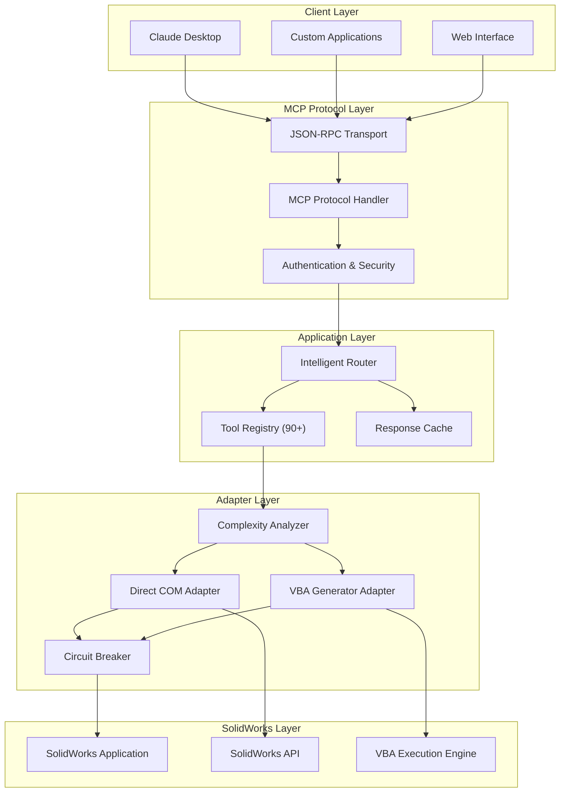
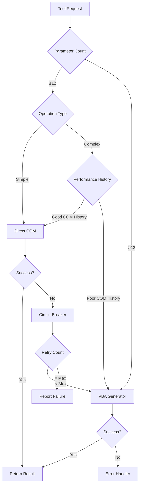
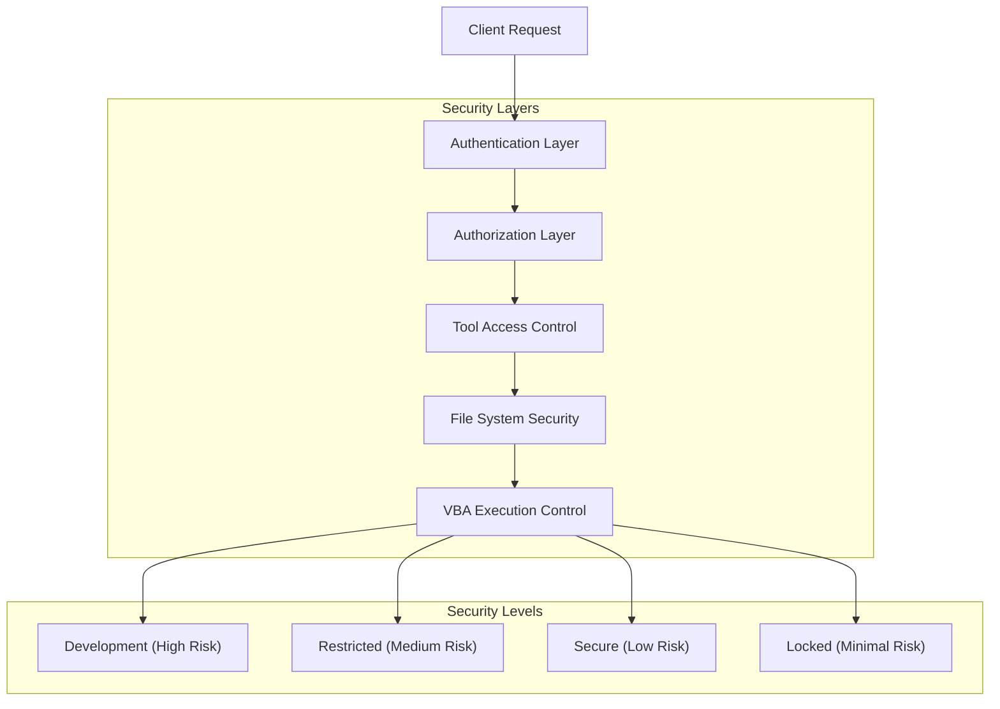
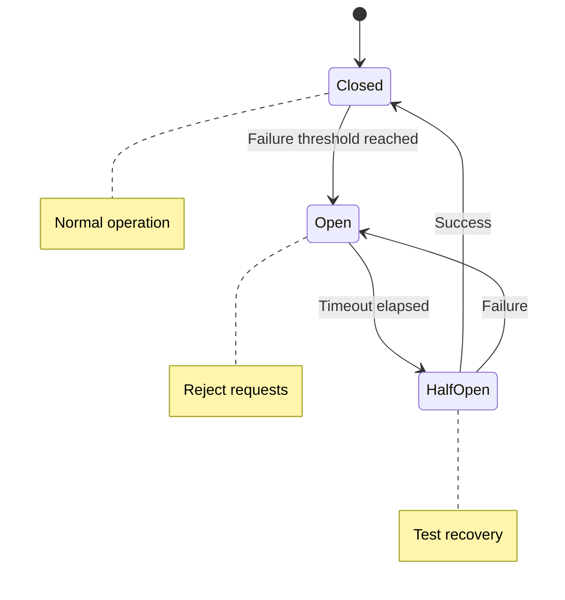

# Architecture Overview

The SolidWorks MCP Server implements an intelligent, multi-layered architecture designed to overcome the limitations of traditional COM-based SolidWorks automation while providing enterprise-grade reliability and security.

## High-Level Architecture

## Implementation Status (April 2026)

| Capability | Status | Notes |
|---|---|---|
| Complexity Analyzer | In progress | Implemented initial analyzer with parameter count, operation profile scoring, and outcome history bias. |
| Intelligent Router | In progress | Implemented runtime COM/VBA routing for selected operations with fallback behavior. |
| Response Cache | In progress | Implemented in-memory TTL cache for selected read-heavy adapter operations. |
| VBA Adapter | In progress | Added VBA route wrapper adapter and factory registration. Current execution still delegates to backing adapter while attaching VBA metadata. |
| Security Runtime Enforcement | In progress | Added runtime API key and rate-limit enforcement in tool invocation path. |
| Distributed Load Balancing | Future state | Current implementation uses local queue-based pooling, not distributed scheduling. |
| OAuth2/JWT Transport Enforcement | Future state | Planned for transport-layer integration in remote deployments. |

For a dated implementation snapshot that may evolve quickly, see the planning docs:

- [Architecture Analysis (Snapshot)](../planning/ARCHITECTURE_ANALYSIS.md)
- [Architecture Alignment Report (Snapshot)](../planning/ARCHITECTURE_ALIGNMENT_REPORT.md)

## Core Components

### 1. Intelligent Router

The core orchestrator that:

- **Route Selection**: Determines optimal execution path based on operation complexity
- **Load Balancing**: Distributes requests across available SolidWorks instances
- **Fallback Management**: Handles failures gracefully with automatic retry strategies
- **Caching**: Stores frequently accessed data to improve performance

### 2. Complexity Analyzer

Advanced analysis engine that examines operations to determine the best execution strategy:

#### Analysis Criteria

- **Parameter Count**: Operations with 13+ parameters typically require VBA
- **Operation Type**: Certain operations (sweeps, lofts) are VBA-preferred
- **Data Complexity**: Large datasets benefit from VBA batch processing
- **Performance History**: Past success/failure rates influence routing decisions

#### Decision Tree

### 3. Adapter Architecture

Dual-adapter system providing multiple execution paths:

#### Direct COM Adapter

- **Speed**: Fastest execution for simple operations
- **Reliability**: Direct API access with immediate feedback
- **Limitations**: Parameter count restrictions, complex operation failures
- **Use Cases**: Basic modeling, simple sketches, property queries

#### VBA Generator Adapter  

- **Flexibility**: Handles any operation complexity
- **Reliability**: Robust handling of complex parameter sets
- **Performance**: Optimized batch operations
- **Use Cases**: Complex features, batch processing, advanced operations

### 4. Security Architecture

Multi-layered security system with configurable protection levels:

#### Security Level Matrix

| Feature | Development | Restricted | Secure | Locked |
|---------|-------------|------------|--------|---------|
| Tool Access | All 90+ | Safe/Moderate | Read-only | Analysis only |
| File System | Full | Limited paths | Read-only | None |
| VBA Execution | Enabled | Controlled | Disabled | Disabled |
| Network Access | Enabled | Disabled | Disabled | Disabled |
| Authentication | None | API Key | OAuth2 | JWT |

### 5. Connection Management

Current runtime connection handling:

#### Connection Pool

- **Instance Reuse**: Maintains a fixed-size pool of adapters
- **Queue-Based Dispatch**: Uses an `asyncio.Queue` to hand out available adapters
- **Health Monitoring**: Exposes adapter and pool health checks
- **Failure Replacement**: Disconnects failed adapters and attempts to create replacements

This is not currently an autoscaling or distributed scheduling system.

#### Circuit Breaker Pattern

## Performance Optimizations

### Current Runtime Behavior

#### Async Tool Execution

- MCP tools are implemented as async handlers
- Connection-pool operations use async acquisition and release
- Batch-oriented tools exist for export, file management, template application, macro execution, and automation

#### What Is Not Implemented Yet

- Multi-level runtime caches for results, feature trees, properties, or queries
- TTL or event-driven cache invalidation
- Generic progress streaming across long operations
- Explicit cancellation for in-progress MCP operations
- Queue-backed background workers or autoscaling execution

Planned runtime improvements are tracked in [Runtime Operations and Observability Plan](../planning/PLAN_RUNTIME_OPERATIONS_AND_OBSERVABILITY.md).

## Error Handling

### Current Error-Handling Mechanisms

#### Runtime and Adapter Layer

- **Circuit Breaker**: Repeated failures can open the circuit and short-circuit new requests
- **Retry with Backoff**: The connection-pool wrapper retries failed pooled operations with incremental delay
- **Adapter Health Checks**: Adapters and the pool expose health metadata
- **Standardized Results**: Many operations return structured success/error payloads instead of raw exceptions

#### Agent/Prompt Testing Layer

- **RecoverableFailure**: Agent runs can return structured remediation guidance and retry focus
- **SQLite Error Memory**: Prompt-test runs can persist errors and tool events for later review

#### What Is Not Implemented Yet

- A formal, global error taxonomy enforced across the full runtime
- Runtime alerting/notification hooks
- Centralized incident routing or external observability integration
- Rich cancellation-aware recovery for long-running jobs

Planned runtime error/observability work is tracked in [Runtime Operations and Observability Plan](../planning/PLAN_RUNTIME_OPERATIONS_AND_OBSERVABILITY.md).

## Monitoring and Observability

### Implemented Today

- Structured application logging
- Adapter and pool health metadata
- Agent-side SQLite logging for runs, tool events, and failure history

### Planned, Not Yet Generalized

- Alerting
- Dashboard-oriented metrics sinks
- Distributed metrics aggregation

These roadmap ideas live in [Runtime Operations and Observability Plan](../planning/PLAN_RUNTIME_OPERATIONS_AND_OBSERVABILITY.md).

## Agent Orchestration Add-On

The project includes a lightweight agent orchestration and prompt-testing layer for custom workspace agents:

- Runtime package: `src/solidworks_mcp/agents/`
- Prompt validation harness: `harness.py`
- Typed output schemas: `schemas.py`
- Local error-memory SQLite: `history_db.py`

This layer is intentionally separate from the core MCP server runtime.

It is useful for:

- prompt validation against typed schemas
- testing specialist workspace agents without changing server tools
- storing run history, tool events, and recoverable failures locally

It is not the same thing as the MCP tool runtime itself, and teams can use the server without adopting this layer.

See:

- [Agents and Prompt Testing](../agents/agents-and-testing.md)
- [Agent UI Workflows](../agents/agent-ui-workflows.md)
- [Agent Memory and Recovery](../agents/agent-memory-and-recovery.md)

## Deployment Patterns

### Local Development

- Single instance with mock SolidWorks for testing
- Full debugging and development tool access
- Hot reloading for rapid development

### Enterprise Production

- Load-balanced multiple instances
- Database-backed caching and state management
- Comprehensive monitoring and alerting
- Security hardening and audit compliance

### Cloud Deployment

- Containerized instances with orchestration
- Auto-scaling based on demand
- Distributed caching and state management
- Global load balancing and CDN integration

---

!!! info "Next Steps"
    - Learn about [Tools Overview](tools-overview.md) to understand available capabilities
    - Check the [Getting Started Guide](../getting-started/quickstart.md) for practical examples
    - Review the codebase for technical implementation details
