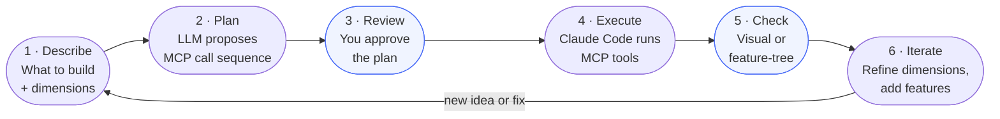

# Prompt-Driven Design with SolidWorks MCP

You know SolidWorks. This guide shows you how to describe what you want to build in plain language, let an LLM translate that into the right tool calls, and have SolidWorks build it — without clicking through menus.

The examples below use real SolidWorks sample parts as targets. Because the finished `.SLDPRT` files already exist, you can open them and check the feature tree to confirm whether your prompts produced the right result. That makes them ideal for learning the workflow before applying it to your own designs.

---

## What You Need

- SolidWorks installed and open
- MCP server running (`.\dev-commands.ps1 dev-install` then `.\dev-commands.ps1 dev-run` if needed)
- Claude Code (this tool) or VS Code with Copilot Chat
- Python environment activated: `.\.venv\Scripts\python.exe`

---

## The Core Workflow

Every design session follows the same loop:



Steps **3 (Review)** and **5 (Check)** are yours. The LLM handles 2 and 4.

---

## Step 1 — Describe What You're Building

Be specific about shape and size. Adjectives like "wide" or "thin" are ambiguous. Geometry and dimensions are not.

### Good description

```text
I want to create a paper airplane shape.
It should be a flat delta-wing profile — like looking down at a paper airplane from above.
The nose points right at (80, 0), the two wing tips are at (0, 60) and (0, -60),
and everything connects back to the origin.
Extrude it 0.5 mm — just enough thickness to represent folded paper.
```

### What not to say

```text
Make me a flat airplane shape, kind of thin.
```

No dimensions. No plane. No feature type. The LLM will guess, and the guess will be wrong.

### Plane names (must be exact)

SolidWorks default planes are case-sensitive. Use these exactly:

| Want to sketch on... | Use |
|---|---|
| Looking down from above | `"Top"` |
| Looking at the front face | `"Front"` |
| Looking from the right side | `"Right"` |

---

## Step 2 — Let the LLM Plan the Tool Sequence

After your description, ask for a plan before executing anything. This is the most important habit — reviewing a text plan takes seconds; undoing a bad extrusion takes longer.

### Prompt to use

```text
Based on this description, write the exact sequence of SolidWorks MCP tool calls
to build it from scratch. Rules:
- Plane names exactly: "Front", "Top", or "Right"
- All dimensions in millimetres
- Dependency order: create_sketch → add geometry → exit_sketch → create feature
- Named arguments on every call
- If any step needs a VBA macro (loft, sweep, shell, sheet metal), say so and write
  the generate_vba_part_modeling call instead of a direct tool call

Show me the numbered list. Do not execute anything yet.
```

The LLM returns a numbered list. Read it. If step 5 says `create_extrusion(depth=500)` and you wanted 5 mm, fix it before running.

---

## Step 3 — Execute the Plan

Once the plan looks right, tell Claude Code to run it:

```text
That looks correct. Execute each step using the SolidWorks MCP server.
Confirm each step succeeds before moving to the next.
If any step fails, stop and show me the error.
```

Claude Code calls each MCP tool in sequence. SolidWorks builds the part live.

---

## Step 4 — Check the Result

### Visual check

Ask Claude Code to export an image:

```text
Export an isometric view: export_image(file_path="my_part.jpg", format_type="jpg")
Then show me the image.
```

Drag the image into the chat or open it in Photos. Does it look right?

### Feature tree check (for sample parts)

If you're building one of the SolidWorks sample parts, open the original:

```text
open_model(file_path=r"C:\Users\Public\Documents\SOLIDWORKS\SOLIDWORKS 2026\samples\learn\Paper Airplane.SLDPRT")
list_features()
close_model(save=False)
```

Compare the feature families and order, not just one matching name. If the original tree shows sheet metal, flanges, bends, or unfold/fold operations, a single matching sketch or extrusion is not enough.

---

## Step 5 — Iterate

Design is never one-shot. Common iteration patterns:

### Change a dimension

```text
The wing is too narrow. Change the wing tip Y coordinates from ±60 to ±80
and re-extrude. Keep everything else the same.
```

### Add a feature

```text
Add a 2mm fillet to all the outer edges of the extrusion.
```

### Fix an error

```text
The extrusion failed with "sketch not closed". Show me the current sketch geometry
and identify which lines are missing to close the profile.
```

---

## Tutorial 1 — Paper Airplane Audit

**Sample file:** `Paper Airplane.SLDPRT`
**SolidWorks feature:** Sheet metal workflow with a base flange and downstream bends
**What you'll learn:** Why the feature tree must drive delegation before you attempt a rebuild

### Your starting prompt

```text
Open the original Paper Airplane sample and inspect it before planning a rebuild.

Run `open_model`, `get_model_info`, `list_features(include_suppressed=True)`,
and `get_mass_properties()`. Then answer:

1. What is the first real modeling feature after the reference planes?
2. Does the tree indicate sheet metal, bends, or unfold/fold states?
3. Which downstream features depend on that first feature?
4. Should this be executed with direct MCP modeling tools, a VBA plan, or both?
```

### Expected conclusion

```python
The Paper Airplane sample is not a good first "single sketch + extrude" lesson.
Its tree must be treated as a sheet metal sequence rooted in a base flange.
Delegate reconstruction planning to the part reconstructor and preserve the
feature-family ordering instead of approximating the silhouette.
```

!!! tip "Use a different warm-up part"
    For the first direct-MCP tutorial, use a simple bracket or the Baseball Bat revolve. Come back to the Paper Airplane only after you have a feature-tree-first workflow in place.

### Execute and check

```text
Execute the plan. After the extrusion, run:
export_image(file_path="paper_airplane_gen.jpg", format_type="jpg")
```

Then open the real sample for comparison:

```text
open_model(file_path=r"C:\Users\Public\Documents\SOLIDWORKS\SOLIDWORKS 2026\samples\learn\Paper Airplane.SLDPRT")
list_features()
close_model(save=False)
```

The useful check here is whether your audit identified the correct feature family and dependency chain. Do not validate this sample by looking for a single `Boss-Extrude1`.

---

## Tutorial 2 — Baseball Bat

**Sample file:** `Baseball Bat.SLDPRT`
**SolidWorks feature:** Half-profile sketch + revolve 360°
**What you'll learn:** How to describe a revolved part and specify the centerline

### Your starting prompt

```text
I want to build a baseball bat in SolidWorks.

Shape: a symmetric bat profile revolved 360° around its long axis
Sketch plane: Right
Dimensions:
  - Total length: 830 mm
  - Revolution axis: centerline along the X axis from (0,0) to (830,0)
  - Knob at handle end: small arc, radius ~17mm centered at (0, 17)
  - Handle: thin cylinder ~17mm radius from x=0 to x=150
  - Taper from handle to barrel: radius increases from 17mm to 35mm, x=150 to x=680
  - Barrel: constant 35mm radius, x=680 to x=790
  - Barrel end cap: small arc closing the top
  - The half-profile connects back to the centerline at both ends

Part name: "Baseball Bat"

Write the MCP tool call sequence. Do not execute yet.
```

### What to watch for in the plan

The plan should include:

1. `create_sketch(plane_name="Right")`
2. `add_centerline(...)` — the revolve axis
3. Multiple `add_line` and `add_arc` calls tracing the half-profile
4. `exit_sketch()`
5. `create_revolve(sketch_name="Sketch1", axis_entity="Line1", angle=360.0)`

If the LLM skips `add_centerline` or tries to use a construction line as the axis without naming it, correct before running:

```text
Step 3 is missing the centerline. Add:
add_centerline(start_x=0, start_y=0, end_x=830, end_y=0)
before the profile lines, and use that as the axis_entity in create_revolve.
```

---

## Tutorial 3 — U-Joint Assembly

**Sample files:** `U-Joint/` directory — 9 parts
**SolidWorks feature:** Multi-part assembly with coincident and concentric mates
**What you'll learn:** How to describe assemblies and mates, and when to use VBA

The U-Joint is the most complex sample and the best model for assembly workflows. Build each part separately first, then assemble.

### Part 1 of 9: Spider

The spider is the cross-shaped centre piece. Start here because it's the assembly anchor.

```text
I want to build the spider component for a U-Joint.

Shape: a cross — four cylindrical arms extending from a central sphere
Sketch plane: Front
Approach: revolve a plus-sign half-profile 360°, or use VBA if needed
Dimensions:
  - Central hub: 15mm radius sphere
  - Four arms: each 8mm radius, 25mm long, pointing in +X, -X, +Y, -Y from hub centre
  - Arms are symmetric

Part name: "spider"

Write the MCP tool call sequence. Flag if VBA is required.
```

### Assembly prompt (after all parts are built)

```text
Create a U-Joint assembly.

Components (all in the same directory):
  crank-shaft.sldprt, yoke_male.sldprt, yoke_female.sldprt,
  spider.sldprt, bracket.sldprt, pin.sldprt, crank-arm.sldprt, crank-knob.sldprt

Assembly mates needed:
  1. crank-shaft long axis coincident with yoke_male bore axis
  2. spider centre coincident with yoke_male rotation centre
  3. spider pin arms fit into yoke_male ear bores (concentric)
  4. yoke_female mirrors yoke_male on the other spider axis pair
  5. bracket fixes to the frame reference

Use generate_vba_assembly_insert and generate_vba_assembly_mates.
Write the sequence — do not execute yet.
```

---

## Using the Agent CLI for Planned Runs

For repeatable, logged runs — especially when testing a new part concept before running in SolidWorks — use the smoke test CLI. Results are saved to `.solidworks_mcp/agent_memory.sqlite3`.

```powershell
# Plan a reconstruction using the reconstructor agent
.\.venv\Scripts\python.exe -m solidworks_mcp.agents.smoke_test `
  --agent-file solidworks-part-reconstructor.agent.md `
  --github-models `
  --schema reconstruction `
  --prompt "Baseball bat: half-profile on Right plane, revolved 360 degrees. 830mm long, 17mm handle radius, 35mm barrel radius. Plan the MCP reconstruction."
```

This returns a validated `ReconstructionPlan` JSON — a structured, typed plan you can hand back to Claude Code for execution.

```powershell
# Get a manufacturability check on your design before committing
.\.venv\Scripts\python.exe -m solidworks_mcp.agents.smoke_test `
  --agent-file solidworks-print-architect.agent.md `
  --github-models `
  --schema manufacturability `
  --prompt "ABS baseball bat handle, 17mm radius, 150mm long. Bambu X1C printer (256x256x256). Print orientation and support strategy?"
```

---

## Iteration Cheat Sheet

| What you want to do | Prompt pattern |
|---|---|
| Change a dimension | `"Change [feature] [dimension] from X to Y. Rerun only the affected steps."` |
| Add a feature | `"Add a [feature] to the existing part. Keep what's already there."` |
| Fix a failed step | `"[error message]. Show me why this failed and fix it."` |
| Start over on one sketch | `"Delete Sketch2 and redo it with: [new description]."` |
| Check against the sample | `"Open [sample path], run list_features(), close without saving. Compare to my part."` |
| Export for 3D printing | `"Export as STL: export_stl(file_path='bat.stl')"` |
| Check mass and dimensions | `"Run get_mass_properties() on the open part."` |

---

## Common Errors

| Error message | What it means | Fix |
|---|---|---|
| `Sketch is still active` | `exit_sketch()` was not called | Always call `exit_sketch()` before any feature creation |
| `Plane not found: "front"` | Wrong capitalisation | Must be `"Front"`, `"Top"`, or `"Right"` |
| `Extrusion failed: sketch not closed` | Profile has a gap | Ask LLM to identify the gap and add the missing line |
| `create_loft is not implemented` | Loft tool not yet in MCP | Use `generate_vba_part_modeling` + `execute_macro` |
| Depth is 1000× too large | Units mismatch | Pass mm values > 0.5; server auto-normalises |
| `RecoverableFailure` from agent CLI | Schema validation failed | Re-run with `--max-retries-on-recoverable 2` |

---

## What's Next

- **[Sample Models Guide](sample-models-guide.md)** — pre-written feature sequences for every learn sample part
- **[Prompting Best Practices](../user-guide/prompting-best-practices.md)** — detailed prompt engineering for MCP tools
- **[Agents and Testing](agents-and-testing.md)** — full agent CLI reference
- **[Tools Overview](../user-guide/tools-overview.md)** — complete MCP tool catalogue

### Planned: Full Reverse-Engineering Workflow

A future guide will document the automated reverse-engineering loop: open an existing part programmatically, read its feature tree and mass properties, feed that data to the `solidworks-part-reconstructor` agent to generate a `ReconstructionPlan`, execute it, and compare outputs via pixel diff and mass property matching. This is tracked in `docs/planning/ROADMAP_2026_2027.md`.
