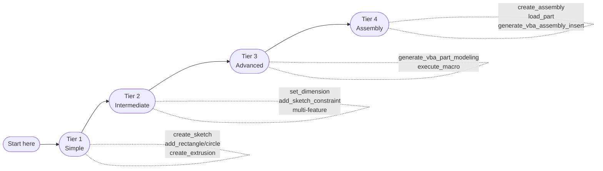

# Sample Models Guide

This guide describes the SolidWorks 2026 learn samples shipped with SolidWorks and explains which MCP tools and prompting strategies best recreate each part from scratch. Reference files live at:

```
C:\Users\Public\Documents\SOLIDWORKS\SOLIDWORKS 2026\samples\learn\
```

## Sample Path Detection (Integration Harness)

The integration harness now auto-discovers sample paths in this order:

1. `SOLIDWORKS_MCP_SAMPLE_MODELS_DIR` (explicit override)
2. `C:\Users\Public\Documents\SOLIDWORKS\SOLIDWORKS 2026\samples\learn`
3. `C:\Users\Public\Documents\SOLIDWORKS\SOLIDWORKS 2025\samples\learn`
4. `C:\Users\Public\Documents\SOLIDWORKS\SOLIDWORKS 2024\samples\learn`
5. `C:\Users\Public\Documents\SOLIDWORKS\SOLIDWORKS 2023\samples\learn`
6. `C:\Users\Public\Documents\SOLIDWORKS\SOLIDWORKS 2022\samples\learn`

Set the override for non-standard installations:

```powershell
$env:SOLIDWORKS_MCP_SAMPLE_MODELS_DIR = "D:\CAD\SOLIDWORKS Samples\learn"
pytest tests/test_all_endpoints_harness.py -k "TestLevelCRealCOM and c09" -v
```

---

## Complexity Tiers

The four tiers determine which MCP tools are needed. Choose your starting point based on how many features the model requires:



| Tier | Description | Key Tools |
|------|-------------|-----------|
| **1 – Simple** | Single sketch + one feature | `create_sketch`, `add_rectangle/circle`, `create_extrusion/revolve` |
| **2 – Intermediate** | 2–4 sketches, multiple features, fillets | + `set_dimension`, `add_sketch_constraint`, `create_extrusion` (multi-step) |
| **3 – Advanced** | Lofts, sweeps, multi-body, sheet metal | + `generate_vba_part_modeling`, `execute_macro` |
| **4 – Assembly** | Multiple parts mated together | `create_assembly`, `load_part`, `generate_vba_assembly_insert` |

---

## Baseball Bat — Tier 1 (Revolve)

**File**: `Baseball Bat.SLDPRT`  
**Core feature**: Profile revolved 360° around centerline  
**Dimensions**: ~83 cm long, 7 cm max diameter


### Feature sequence

0. `get_model_info` + `list_features` + `classify_feature_tree` — confirm it is a revolve family
1. `create_sketch` on Right plane
2. `add_centerline` along Y-axis (revolution axis)
3. `add_line` / `add_arc` — half-profile (handle, taper, barrel, knob)
4. `exit_sketch`
5. `create_revolve` with 360°

### Key LLM prompt

```
Create a baseball bat model:
0. inspect the original sample and confirm `classify_feature_tree` recommends `direct-mcp-revolve`
1. create_part with name "Baseball Bat"
2. create_sketch on the "Right" plane
3. add_centerline from (0,0) to (830,0) — the revolution axis
4. Trace the half-profile with add_line and add_arc:
   - Knob: add_arc center at (0,17) radius 17 from (0,34) to (17,17)
   - Handle: add_line from (17,17) to (17,22) → at y=22 taper to (680,35) → barrel
   - Barrel top: add_arc center at (680,0) from (680,35) to (680,-35) (semicircle)
   - Return to origin on the axis
5. exit_sketch
6. create_revolve with sketch_name="Sketch1", axis_entity="Line1", angle=360.0
```

!!! tip "Why revolve first?"
    A bat is the cleanest possible revolve exercise. If `create_revolve` is working, your COM adapter is healthy.

---

## Paper Airplane — Tier 3 (Sheet Metal)

**File**: `Paper Airplane.SLDPRT`  
**Core feature**: Sheet metal base flange with downstream flanges and bends

### Feature sequence

1. Read the real feature tree and confirm the sheet metal root feature.
2. Identify the base flange sketch and the downstream bend/flange operations.
3. Route reconstruction through a VBA-aware plan if direct sheet metal tools are unavailable.

### Key LLM prompt

```
Open the original `Paper Airplane.SLDPRT` and inspect `list_features(include_suppressed=True)`.
If the tree shows `Sheet-Metal`, `Base-Flange`, `Edge-Flange`, `Sketched Bend`,
`Unfold`, or `Fold`, generate a reconstruction plan that preserves that sequence.
Do not teach this model as a single-sketch extrusion example.
```

---

## Garden Trowel — Tier 2

**File**: `Garden Trowel/Garden Trowel_Garden_Trowel_Spade.SLDPRT`  
**Core feature**: Spade is a swept-lofted surface; handle is a revolved rod

### Recommended MCP approach (two-sketch extrude approximation)

For an LLM, a 2-sketch loft is the practical path:

```
1. create_part "Garden Trowel Spade"
2. create_sketch on "Front" plane — spade cross-section ellipse
   add_ellipse center_x=0, center_y=0, major_radius=40, minor_radius=15
3. exit_sketch
4. create_extrusion sketch_name="Sketch1", depth=160
5. create_sketch on "Top" plane — taper reference
6. add_rectangle x1=-15, y1=0, x2=15, y2=160
7. exit_sketch
```

!!! note "Loft not yet available"
    `create_loft` is not yet implemented. Use VBA to perform a proper loft:
    call `generate_vba_part_modeling` with `operations` describing the loft, then `execute_macro`.

---

## Carving Knife — Tier 2

**Files**: `Carving Knife/Knife Handle-DEMO.SLDPRT`, `Left Blade.SLDPRT`, `Right Blade.SLDPRT`

### Blade

1. `create_sketch` on Front — blade profile (thin triangle)
2. `add_line` to draw taper from tang to tip
3. `create_extrusion` depth = 3 (blade thickness)
4. Chamfer/fillet edges via `generate_vba_part_modeling`

### Handle

1. `create_sketch` on Right plane — handle oval cross-section
2. `add_ellipse` major/minor for comfortable grip
3. `create_extrusion` depth = 130

### Key LLM prompt

```
Create a carving knife blade:
1. create_part "Knife Blade"
2. create_sketch on "Front" plane
3. add_line (0,0)→(200,0) — spine
4. add_line (0,0)→(0,20) — tang height
5. add_line (0,20)→(200,0) — cutting edge taper
6. exit_sketch
7. create_extrusion sketch_name="Sketch1", depth=3
```

---

## Mouse Bottom Housing — Tier 3

**File**: `Mouse/Bottom Housing.SLDPRT`

This is a complex injection-molded shell with:

- Outer shell extruded from an ergonomic profile
- Multiple boss features for PCB standoffs
- Snap-fit tabs on edges
- Multiple through-holes for USB / scroll wheel

### Recommended MCP approach

Use `generate_vba_part_modeling` to script the full feature tree, then `execute_macro` to run it. The granular step-by-step approach (individual MCP tool calls) is impractical for 20+ features.

```python
# Request VBA for multi-feature shell
result = generate_vba_part_modeling(operations=[
    {"type": "sketch", "plane": "Top", "entities": [
        {"kind": "line", "points": [[0,0],[130,0],[130,65],[0,65]]},
        {"kind": "arc", "center": [65,65], "start": [0,65], "end": [130,65]}
    ]},
    {"type": "extrude", "sketch": "Sketch1", "depth": 35},
    {"type": "shell", "thickness": 2, "open_faces": ["top"]},
    {"type": "boss_sketch", "plane": "Top", "features": "pcb_standoffs"},
])
execute_macro(macro_path="generated_mouse_bottom.swp")
```

---

## Sheet Metal Parts — Tier 2

**Files**: `Sheet Metal/Simple Sheet Metal Part.SLDPRT`, `Complex Sheet Metal Part.SLDPRT`

!!! warning "Sheet metal tools"
    The MCP server does not yet expose `SwSheetMetal` API methods directly. Use `generate_vba_part_modeling` with sheet metal operation dicts, or `execute_macro` with a hand-written SolidWorks macro.

### Simple sheet metal bracket prompt

```
Create a simple sheet metal bracket:
1. create_part "Sheet Metal Bracket"
2. create_sketch on "Front" plane
3. add_line (0,0)→(100,0)→(100,50)→(0,50)→(0,0) — base flange profile
4. exit_sketch
5. create_extrusion sketch_name="Sketch1", depth=2 — base plate
6. Then use generate_vba_part_modeling to add:
   - Edge flange on right edge, 30mm up, outward
   - Edge flange on left edge, 30mm up, outward
   - K-factor 0.44, bend radius 1.5mm
```

---

## U-Joint Assembly — Tier 4

**Files**: `U-Joint/` — crank-shaft, spider, yoke_male, yoke_female, bracket, pin, crank-arm, crank-knob, retaining ring

### Assembly workflow

```
1. create_assembly "U-Joint"
2. generate_vba_assembly_insert component_path="crank-shaft.sldprt"
3. generate_vba_assembly_insert component_path="yoke_male.sldprt"
4. generate_vba_assembly_mates mate_type="coincident"  ← shaft axis ↔ yoke bore
5. generate_vba_assembly_insert component_path="spider.sldprt"
6. generate_vba_assembly_mates mate_type="coincident"  ← spider pins ↔ yoke ears
```

---

## Sprinkler System Assembly — Tier 4

**Files**: 20+ parts in `Sprinkler/`  

The sprinkler is the most complex assembly in the sample set. Use `batch_file_operations` to collect all part paths, then `load_assembly`.

```
1. load_assembly file_path="Sprinkler\Sprinkler.SLDASM"
2. get_file_properties   ← read material, revision, descriptions
3. calculate_mass_properties  ← total assembly mass
4. check_interference   ← verify no clashes between components
5. export_step file_path="Sprinkler_export.step"
```

---

## Screenshot Equivalence Validation

After recreating any part with MCP tools:

1. **Reference image** — export from the shipped sample:

   ```
   open_model file_path="<sample_path>"
   export_image file_path="ref_image.jpg" format_type="jpg"
   close_model save=false
   ```

2. **Generated image** — export from your MCP-created part:

   ```
   export_image file_path="gen_image.jpg" format_type="jpg"
   ```

3. **Compare** using the `src/utils/screenshot_compare.py` utility (see [Screenshot Equivalence](../user-guide/screenshot-equivalence.md)).

The **done criterion** for each model is a pixel-difference score below **5%** at 1920×1080 isometric view.

---

## All Sample Parts Reference Table

| Part | Category | Tier | Key Features |
|------|----------|------|--------------|
| Baseball Bat | Single part | 1 | Revolve, profile |
| Paper Airplane | Single part | 1 | Extrude, flat |
| Garden Trowel Spade | Single part | 2 | Loft/sweep, organic |
| Garden Trowel Handle | Single part | 2 | Extrude, trim |
| Knife Blade (L/R) | Single part | 2 | Extrude, chamfer |
| Knife Handle | Single part | 2 | Extrude, fillet |
| Carving Knife Guard | Single part | 2 | Mirror, extrude |
| Coping Saw | Single part | 2 | Extrude, multi-sketch |
| Mouse Bottom Housing | Single part | 3 | Multi-feature shell |
| Mouse Top Housing | Single part | 3 | Shell, loft |
| Mouse Battery Cover | Single part | 2 | Extrude, flex feature |
| Mouse Buttons | Single part | 2 | Extrude, split |
| Mouse Wheel | Single part | 2 | Revolve, knurl pattern |
| Simple Sheet Metal | Sheet metal | 2 | Base flange, edge flange |
| Complex Sheet Metal | Sheet metal | 3 | Multi-flange, cutouts |
| Sprinkler Body | Single part | 3 | Revolved shell, ports |
| Sprinkler Shaft | Single part | 2 | Revolve, keyway |
| U-Joint Yoke | Single part | 2 | Extrude, bore |
| U-Joint Spider | Single part | 2 | Revolve, cross-arms |
| U-Joint Assembly | Assembly | 4 | 9 parts, 12+ mates |
| Sprinkler Assembly | Assembly | 4 | 20+ parts, hydraulic |
