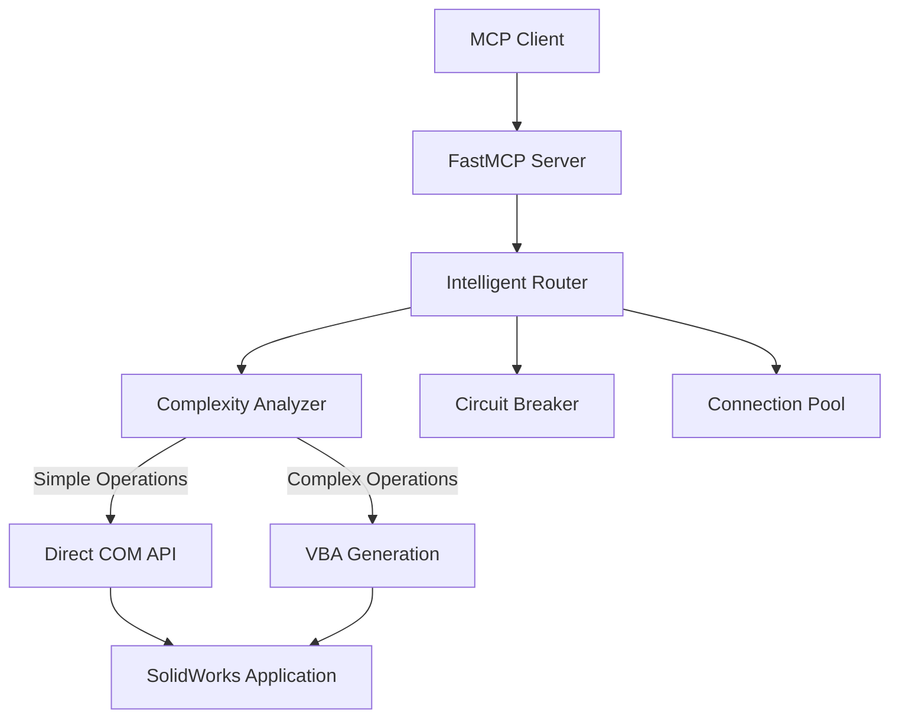

# SolidWorks MCP Server

> ⚠️ **Project Status:** This project is under active construction. Features, APIs, documentation, and setup steps may change as the Python implementation is finalized. This is a hobby/research product, please feel free to make an issue if you have questions or feedback! ⚠️

[](https://www.python.org/downloads/)
[](https://modelcontextprotocol.io)
[](https://opensource.org/licenses/MIT)
[](https://www.microsoft.com/windows)
[](https://www.solidworks.com/)
[](https://andrewbartels1.github.io/SolidworksMCP-python/)
[](https://github.com/andrewbartels1/SolidworksMCP-python/actions/workflows/ci.yml)
[](https://codecov.io/gh/andrewbartels1/SolidworksMCP-python)

**AI-Assisted SolidWorks Automation with MCP**

🚀 **106 Tools** | 🤖 **Agent-Ready Workflows** | ⚡ **Automatic COM/VBA Routing** | 🧪 **Schema-Validated Prompt Runs**

## Overview

An attempt to practical MCP server for SolidWorks focused on faster iteration with AI: describe intent, generate a plan, execute tools, inspect results, and iterate.

It supports both experienced CAD users and newer makers who want a tutor-like assistant for 3D-printable design workflows.

## Motivation

This project came from a pretty simple problem: I did not have enough time to keep iterating on my 3D printing hobby projects, especially failed prints/parts I wanted to fix quickly. I also had a couple of SolidWorks courses behind me, but still wanted faster ways to go from idea to printable part with less hassle and iterate faster.

In 2024, I started a VBA script to generate a D-100 die (100-sided dice) for a friend in SolidWorks and tried using SOTA models like Claude Sonnet and ChatGPT for help with the SolidWorks VBA API. The experience was ***terrible***. The models were often confidently wrong, struggled with basic API/version details, and seemed to miss core CAD sequencing (sketch -> feature -> part -> assembly).

Even with around 1,000 hours in SolidWorks, I still have practical workflow questions: should I import a mesh and convert it, or model from scratch, and what approach will stay printable without taking forever? Out-of-the-box prompting did not connect any of those dots.

So this repo is my attempt to close that gap, or at least research what is feasible. It is a hobby/research project, and if these findings help someone else build faster, that is a win. Feel free to open an issue with questions or feedback.

## Why This Project Is Useful Now

### 1) AI-Assisted CAD Iteration That (Tries) to Stays Grounded

The project emphasizes an inspect -> classify -> delegate loop instead of blind generation. In practice this means:

- read model state first (`get_model_info`, `list_features`, `get_mass_properties`)
- classify feature family before planning (`classify_feature_tree`)
- route to direct MCP or VBA-backed execution based on evidence

### 2) Broad Tool Surface with Practical Coverage

- 106 tools across modeling, sketching, drawing, analysis, export, automation, templates, macros, and docs discovery
- one server API surface for both simple operations and advanced workflows

### 3) Reliable Execution Path for Complex Operations

- direct COM calls for straightforward operations
- automatic VBA generation fallback for higher-complexity calls
- circuit-breaker and connection-pool patterns for stability under repeated use

### 4) Agentic Layer with Real Validation

- Pydantic and PydanticAI schema validation for structured outputs
- recoverable-failure handling and retry flow for prompt-driven runs
- local SQLite logging and timeline inspection for reproducibility and debugging

### 5) Lower Barrier for New CAD/3D Printing Users

- prompt-driven tutorials and worked examples designed for "describe -> review -> build"
- specialist agents for manufacturability, documentation workflows, and research validation
- practical orientation for people who know 3D printing goals but are still learning CAD execution

## Security and Deployment Controls

Security is included and configurable, but it is not the primary value proposition of this project.

The server still provides multiple security/deployment modes for local development, controlled internal use, and constrained environments when needed.

## Current Product Positioning

- Best fit: AI-assisted SolidWorks automation and workflow acceleration
- Also good for: reusable tutorials, team playbooks, and prompt-to-tool validation
- Not positioned as: security middleware first (cupcake)

## What You Can Do Quickly

- build and modify SolidWorks parts from prompt-driven plans
- audit existing sample parts before reconstruction
- compare outputs with feature tree and mass-property checks
- run schema-validated agent prompts and store run history for review

## Quick Start

Choose the path that matches your setup:

### Windows only

Use this when SolidWorks and the MCP server run on the same Windows machine.
This is the verified setup path.

```powershell
git clone https://github.com/andrewbartels1/SolidworksMCP-python.git
cd SolidworksMCP-python
python -m venv .venv
.\.venv\Scripts\python.exe -m pip install --upgrade pip setuptools wheel
.\.venv\Scripts\python.exe -m pip install -e .
powershell -NoProfile -ExecutionPolicy Bypass -File .\run-mcp.ps1
```

Healthy startup logs include:

- `Platform: Windows`
- `SolidWorks COM interface is available`
- `Registered 76 SolidWorks tools`
- `Connected to SolidWorks`

### Linux / WSL only

Use this for mock-mode development, tests, and documentation work.

```bash
git clone https://github.com/andrewbartels1/SolidworksMCP-python.git
cd SolidworksMCP-python
make install
make test
make docs
```

### Linux / WSL client + Windows host

Use this when SolidWorks runs on Windows and your client or development workflow runs on Linux/WSL.

```powershell
.\.venv\Scripts\python.exe -m solidworks_mcp.server --mode remote --host 0.0.0.0 --port 8000
```

```bash
make install
make test
```

Then connect your client to `http://<windows-host-ip>:8000`.

## Tool Categories

| Category | Tools | Description |
|----------|-------|-------------|
| **Modeling** | 9 | Part creation, features, assemblies |
| **Sketching** | 17 | Complete sketching toolkit with constraints |
| **Drawing** | 8 | Drawing creation and management |
| **Drawing Analysis** | 10 | Quality analysis and compliance checking |
| **Analysis** | 4 | Mass properties, simulation, validation |
| **Export** | 7 | Multi-format export and conversion |
| **Automation** | 8 | Batch processing and workflows |
| **File Management** | 3 | File operations and organization |
| **VBA Generation** | 10 | Dynamic VBA code for complex operations |
| **Template Management** | 6 | Template creation and standardization |
| **Macro Recording** | 8 | Macro recording, optimization, and libraries |

## Architecture Overview

The SolidWorks MCP Server uses an intelligent adapter architecture that automatically routes operations between direct COM API calls and VBA macro generation based on complexity analysis:



## Getting Started

Ready to automate your SolidWorks workflows? Check out our comprehensive guides:

- [**Installation Guide**](getting-started/installation.md) - Set up your development environment
- [**Quick Start**](getting-started/quickstart.md) - Your first SolidWorks automation  
- [**Agents and Prompt Testing**](agents/agents-and-testing.md) - Use custom agents and validate outputs with PydanticAI + SQLite memory
- [**VS Code MCP Setup**](getting-started/vscode-mcp-setup.md) - Connect VS Code and GitHub Copilot to this server
- [**Claude Code MCP Setup**](getting-started/claude-code-setup.md) - Connect Claude Code to this server
- [**Architecture Overview**](user-guide/architecture.md) - Understand the system design
- [**Tools Overview**](user-guide/tools-overview.md) - Explore all 90+ available tools
- [**Agent UI Workflows**](agents/agent-ui-workflows.md) - Plan visual decision workflows for hinges, sourcing, and printability
- [**Agent Memory and Recovery**](agents/agent-memory-and-recovery.md) - Use local SQLite history to troubleshoot and recover from failure states

---

**Ready to get started?** → [Installation Guide](getting-started/installation.md)
