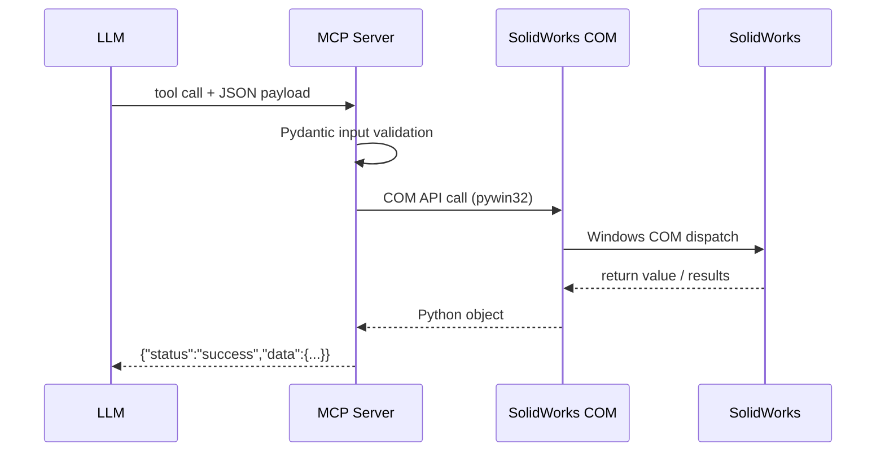

# Tool Catalog — All 106 Tools

This reference documents all **106 MCP tools** registered by the SolidWorks MCP server.
Each section covers one functional category with parameter tables and copy-paste sample calls.


## Quick Navigation

| Category | Count | Description |
|----------|-------|-------------|
| [Modeling Tools](modeling.md) | 9 | Create and manipulate SolidWorks parts, assemblies, and drawings, including sketches, extrusions, revolves, and assemblies. |
| [Sketching Tools](sketching.md) | 18 | Build 2-D sketch geometry (lines, circles, arcs, splines, polygons) and apply geometric constraints and dimensions. |
| [Drawing Tools](drawing.md) | 12 | Create and edit 2-D technical drawings: add projected, section, and detail views, place annotations, and auto-dimension layouts. |
| [Drawing Analysis Tools](drawing-analysis.md) | 8 | Quality-gate your drawings by analyzing dimensions, annotations, view coverage, standards compliance, and completeness. |
| [Analysis Tools](analysis.md) | 5 | Extract engineering properties from models, including mass, volume, center of mass, inertia, and material metadata. |
| [Export Tools](export.md) | 7 | Convert SolidWorks models to industry-standard interchange and manufacturing formats such as STEP, IGES, STL, DWG, PDF, and images. |
| [File Management Tools](file-management.md) | 14 | Open, save, and manage SolidWorks documents; load parts and assemblies, save variants, inspect model metadata, and classify model families. |
| [Automation Tools](automation.md) | 8 | Orchestrate multi-step workflows, run batch file processing, manage design tables, and tune performance settings. |
| [VBA Generation Tools](vba-generation.md) | 10 | Generate and execute VBA macro code for operations that exceed direct COM call complexity or require procedural automation. |
| [Template Management Tools](template-management.md) | 6 | Create, extract, apply, compare, and manage SolidWorks document templates in a reusable library workflow. |
| [Macro Recording Tools](macro-recording.md) | 7 | Record, replay, analyze, and optimize SolidWorks VBA macros, including macro libraries and batch execution workflows. |
| [Docs Discovery Tools](docs-discovery.md) | 2 | Introspect the live SolidWorks COM object library to discover available interfaces, methods, and practical API usage guidance. |

## Standard Response Envelope

Every tool returns a dictionary with at least:

```json
{
  "status": "success" | "error",
  "message": "Human-readable description",
  "data": { ... },
  "execution_time": 0.123
}
```

On error, `data` is omitted and `message` contains the failure reason.

## Request → Response Flow



## Calling Tools from an LLM

Pass parameters as a JSON object.  Only **required** fields (marked ✅) must be included.
All others default to sensible values.

```text
Goal: calculate mass of the open model

Tool: calculate_mass_properties
Payload: {}
```

```text
Goal: export active part to STEP

Tool: export_step
Payload:
{  "file_path": "C:\\Temp\\part.step" }
```
